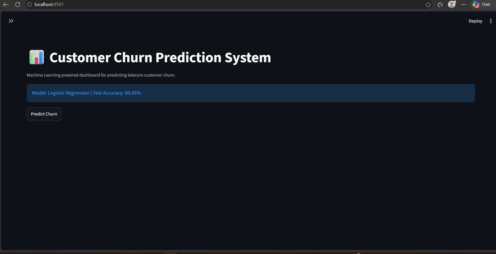
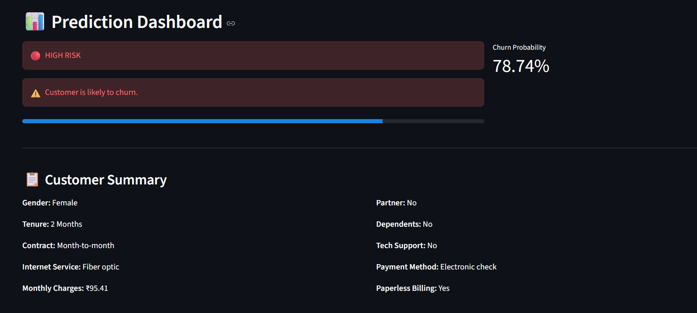
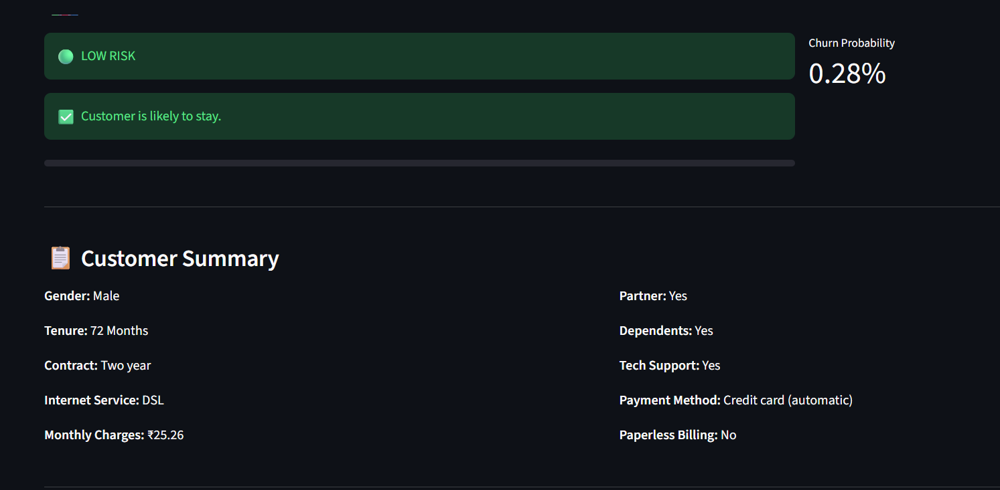
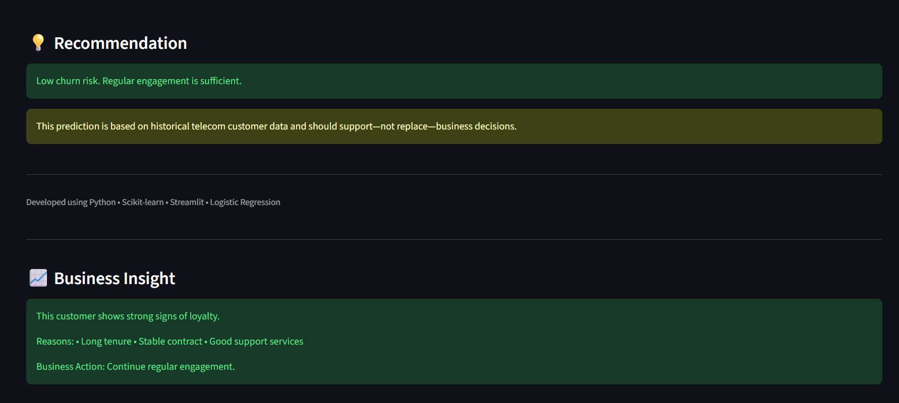

# 📊 Customer Churn Prediction System


##  Overview

The **Customer Churn Prediction System** is an end-to-end Machine Learning project developed to predict whether a telecom customer is likely to discontinue the service (churn).

The project demonstrates the complete Machine Learning lifecycle including:

- Data Cleaning
- Exploratory Data Analysis (EDA)
- Feature Engineering
- Model Training
- Model Evaluation
- Hyperparameter Tuning
- Deployment using Streamlit

The final application provides real-time churn prediction along with business recommendations through an interactive dashboard.

---

#  Problem Statement

Customer churn is one of the biggest challenges faced by telecom companies.

Retaining an existing customer is significantly more cost-effective than acquiring a new one. This project helps identify customers who are at a higher risk of leaving, enabling businesses to take proactive retention measures.

---

#  Tech Stack

- Python
- Pandas
- NumPy
- Scikit-learn
- Matplotlib
- Seaborn
- Streamlit
- Joblib

---

#  Dataset

Dataset Used:

IBM Telco Customer Churn Dataset

Dataset Size:

- 7043 Customers
- 21 Original Features

---

#  Machine Learning Workflow

```
Raw Dataset
      │
      ▼
Data Cleaning
      │
      ▼
Exploratory Data Analysis
      │
      ▼
Feature Engineering
      │
      ▼
One-Hot Encoding
      │
      ▼
Feature Scaling
      │
      ▼
Train/Test Split
      │
      ▼
Model Training
      │
      ▼
Hyperparameter Tuning
      │
      ▼
Model Evaluation
      │
      ▼
Streamlit Deployment
```

---

#  Models Evaluated

| Model | Accuracy |
|--------|---------:|
| Logistic Regression | **80.45%** |
| Random Forest | 78.82% |
| XGBoost | 77.11% |
| Decision Tree | 71.64% |

**Final Selected Model:** Logistic Regression

Reason:

- Highest overall accuracy
- Better generalization
- Simpler and interpretable model
- Fast prediction time

---

#  Features of the Application

- Interactive Streamlit Dashboard
- Customer Information Form
- Real-time Churn Prediction
- Churn Probability
- Risk Classification
- Customer Summary
- Business Recommendation
- Business Insights

---

#  Project Structure

```text
customer-churn-prediction/

├── app.py
├── README.md
├── requirements.txt

├── data/
│   ├── raw/
│   └── processed/

├── models/
│   ├── best_logistic_model.pkl
│   └── scaler.pkl

├── notebooks/

├── outputs/

```

---

# ▶️ Installation

Clone the repository

```bash
git clone <repository-url>
```

Move into the project

```bash
cd customer-churn-prediction
```

Create Virtual Environment

```bash
python -m venv venv
```

Activate Environment

Windows

```bash
venv\Scripts\activate
```

Install Dependencies

```bash
pip install -r requirements.txt
```

Run Application

```bash
streamlit run app.py
```

---

#  Application Screenshots

##  Home Screen




##  High Risk Prediction




##  Low Risk Prediction




##  Prediction Dashboard




#  Future Improvements

- Deep Learning Model
- SHAP Explainability
- Docker Deployment
- Cloud Deployment (AWS/Azure)
- Customer Segmentation
- Email Alert System

---

#  Author

Anushi Mishra

B.Tech Computer Science Engineering

Machine Learning | Data Science | Software Development